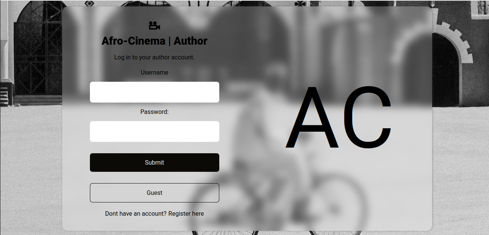
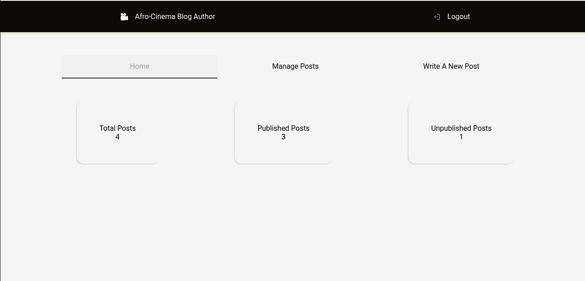

# PERN Afro Cinema Blog Author App | FRONTEND

Afro Cinema Blog Author app, to allow users to manage blog posts.

### Afro Cinema Blog App | Backend

[https://github.com/Lspacedev/afro-cinema-blog-api](https://github.com/Lspacedev/afro-cinema-blog-api)

## Installation

1. Clone the repository

````bash
git@github.com:Lspacedev/afro-cinema-blog-author.git
```

2. Navigate to the project folder

```bash
cd afro-cinema-blog-author
````

3.  Install All Dependencies

```bash
npm install
```

4. Create an env file and add the following:

```bash
VITE_PROD_URL="Deployed backend url or localhost"
```

5. Run the project

```bash
npm run dev
```

## Screenshot




## Features

- Create an account.
- Login an account.
- View all blogs.
- View individual blog.
- Create blog post.
- Update blog post.
- Delete blog post.

- Publish and unpublish post.

## Usage

1. Open the live site in your browser.
2. Login or create an account.
3. Manage blog posts.

## Tech Stack

- ReactJs
- NodeJs
- ExpressJs
- PostgreSQL
- Supabase storage
- Socket.io

## Credits:

```python
Photo by Khalifa Yahaya: https://www.pexels.com/photo/monochrome-scene-of-cyclist-in-traditional-attire-30058926/

Photo by Pavel Danilyuk: https://www.pexels.com/photo/grayscale-photo-of-empty-seats-in-movie-theater-7234227/

```
